# 1. Создайте двух пользователей: user1 и user2. 
Установите для них пароли и войдите в систему под именем одного из созданных пользователей.

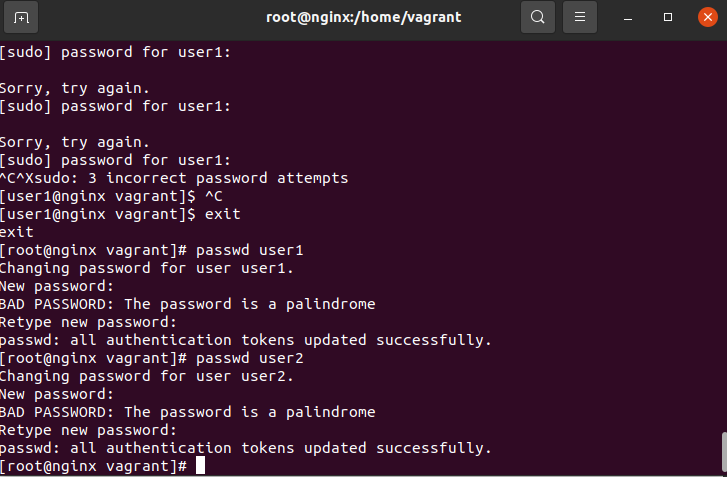

# 2. Заблокируйте ранее добавленную учетную запись пользователя user1,
выйдите из системы и убедитесь, что учетная запись больше не может обращаться к
системе. Затем разблокируйте учетную запись user1. Создайте две новые группы,
называемые group1 и group2. Выполните команду, которая добавит учетную запись
user2 в обе эти группы. Используйте одиночную команду для добавления этого
пользователя сразу к двум группам.

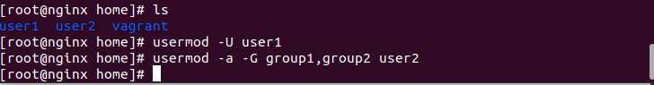

# 3. Добавьте пользователя user2 в соответствующий файл, чтобы пользователь
имел возможность выполнять команды с привилегиями суперпользователя/root. Войдя
в систему как пользователь user2, создайте небольшой текстовый файл с любым
содержимым в каталоге /root.

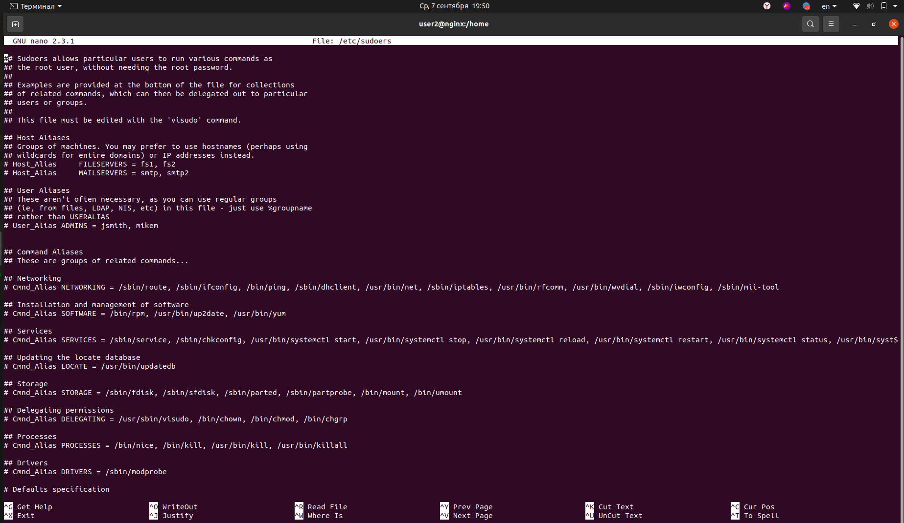
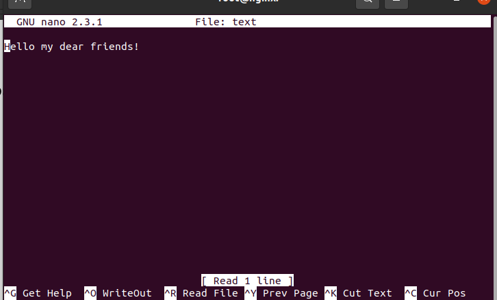

# 4. Войдите в систему под именем пользователя root. Создайте новый каталог в
домашнем каталоге пользователя root, называемый ‘filemaintenance’. Перейдите в этот
каталог и создайте три файла: file1, file2 и file3. Вернитесь в родительский каталог
(домашний каталог root), а затем скопируйте файлы, расположенные в filemaintenance,
в домашний каталог root.

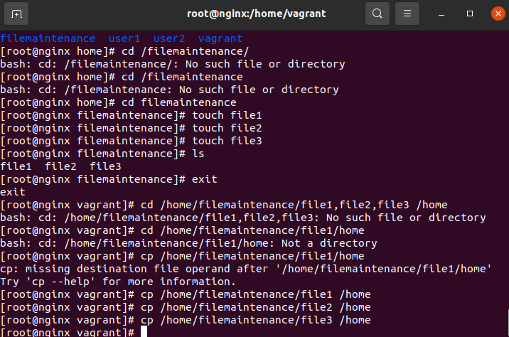

# 5. Вернитесь в домашний каталог пользоaвателя root.
 Переместите каталог «filemaintenance» и все его содержимое в другой каталог с именем «movedfiles».

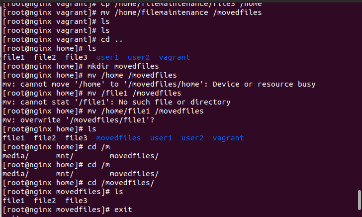

# 6. Заблокируйте учетную запись user1 еще раз. Выйдите из системы.
Попытайтесь войти в систему три раза, используя недавно заблокированную учетную
запись пользователя user1. После третьей неудачной попытки войдите в систему как
пользователь root и разблокируйте пользователя. Затем просмотрите последние 10
строк соответствующего файла журнала в системе, которые будут отображать эти
неудачные попытки входа.

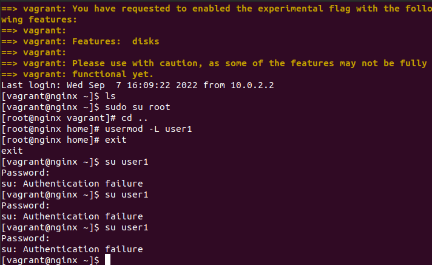

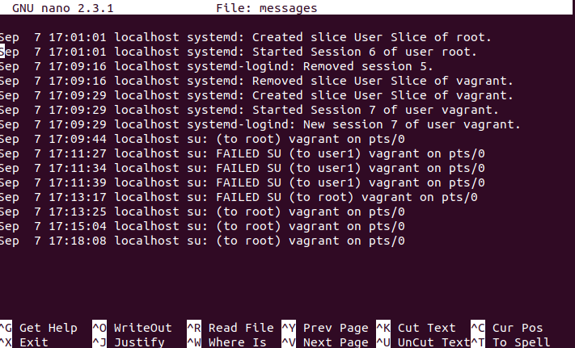

# 7. Войдите в систему под учетной записью root, произведите поиск в системе
файла конфигурации с названием «ld.so.conf» и вызовите строку с его
местоположением и адресом. Перенаправьте содержимое этого файла во второй файл
с именем ld.so.conf.out в вашем домашнем каталоге.

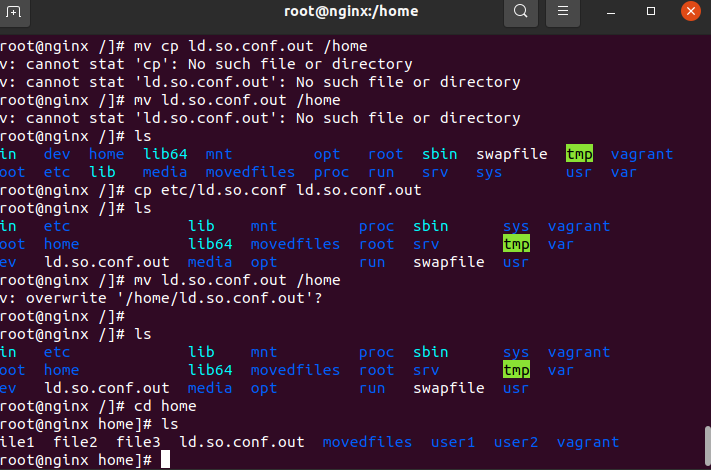

# 8. Скопируйте следующие файлы в домашний каталог пользователя root:
• /etc/hosts
• /var/log/dmesg
• /usr/bin/whoami
Измените права доступа каждого файла следующим образом:
• hosts
— только пользователь-владелец файла может
читать/записывать/выполнять, нет прав доступа для группы и остальных
пользователей
• dmesg
– пользователь-владелец может читать/записывать, группа и остальные
пользователи — читать/выполнять
• whoami
— каждый имеет право на выполнение, никаких других разрешений

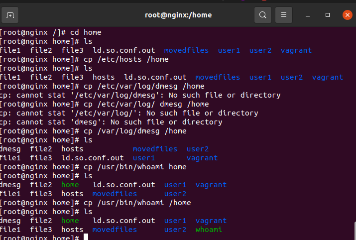

# 9. Измените владельца и группу всех файлов выше, чтобы они принадлежали
# user2.

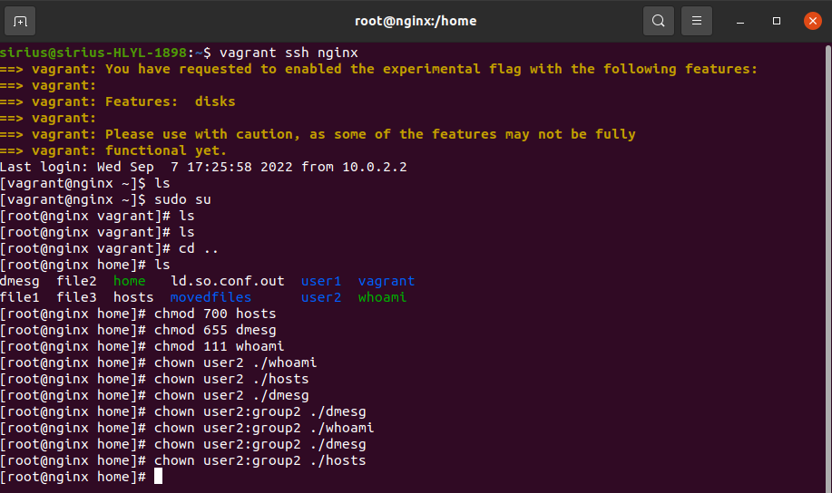

# 10. Войдите в систему как root, если вы еще этого не сделали.
Создайте задание cron, которое будет создавать список всех пользователей, каталоги которых имеются в
домашнем каталоге (home) каждый день в полдень и сохранять данный список в
файле, называемом «cronoutput.out», который вы создадите в своей домашней
директории.

# 11. Создайте еще одно задание cron, выполняющее тот же процесс, что и
# последний, в 15 минут каждого часа (0:15, 1:15, 2:15 и т.д).

# 12. Создайте еще одно задание cron, которое выполняет тот же процесс, что и
# последние два, но каждые 3 минуты между полуночью и 1:00 каждого 1-го числа
# месяца.

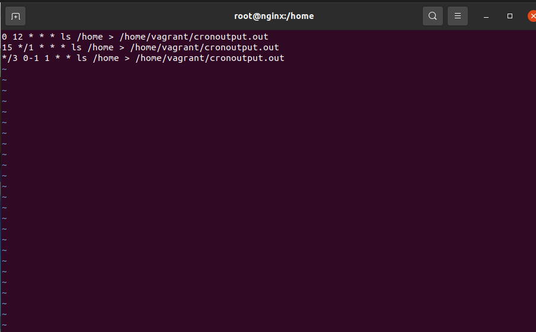

# 13. Выполните команду для подготовки вашей системы к установке пакетов, используя apt-get или yum.
 Произведите поиск доступных пакетов и описаний для веб-
сервера Apache. Перенаправьте эти результаты в файл с именем «search.out» в
домашнем каталоге root.

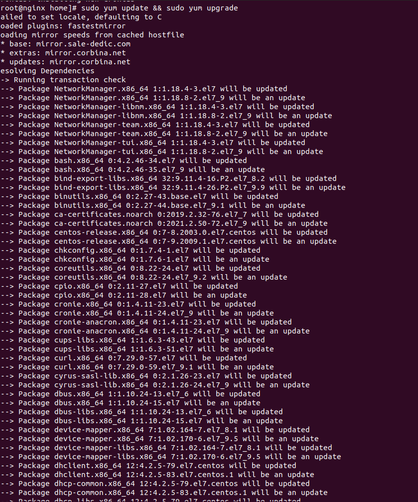
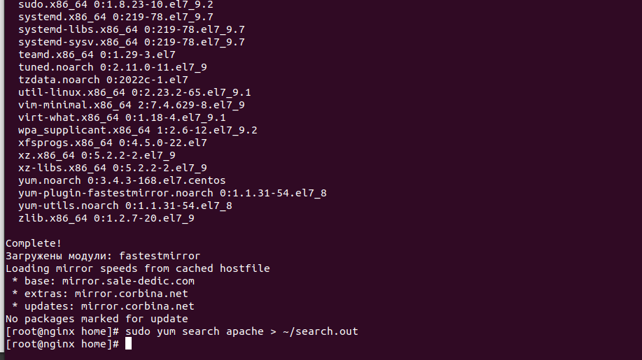

# 14. Установите все доступные системные обновления для вашей системы. 
Так же, установите веб-сервер Apache. При выполнении установки передайте
соответствующий параметр в командную строку, чтобы вас не попросили подтвердить
установку.

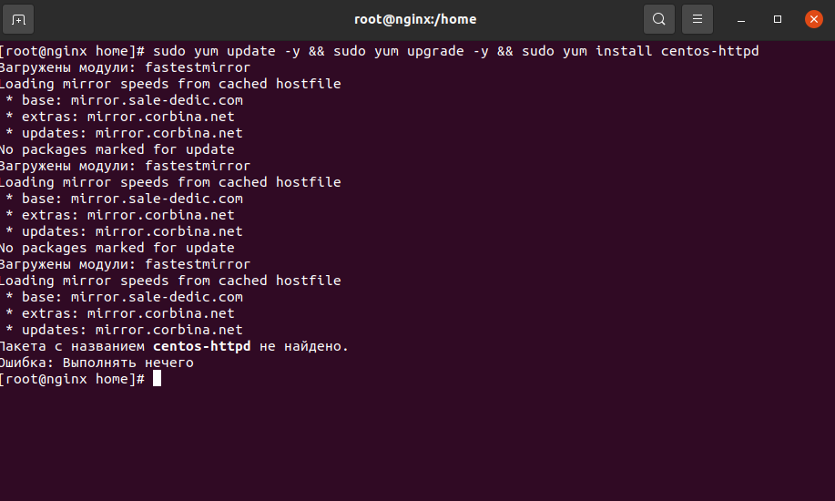